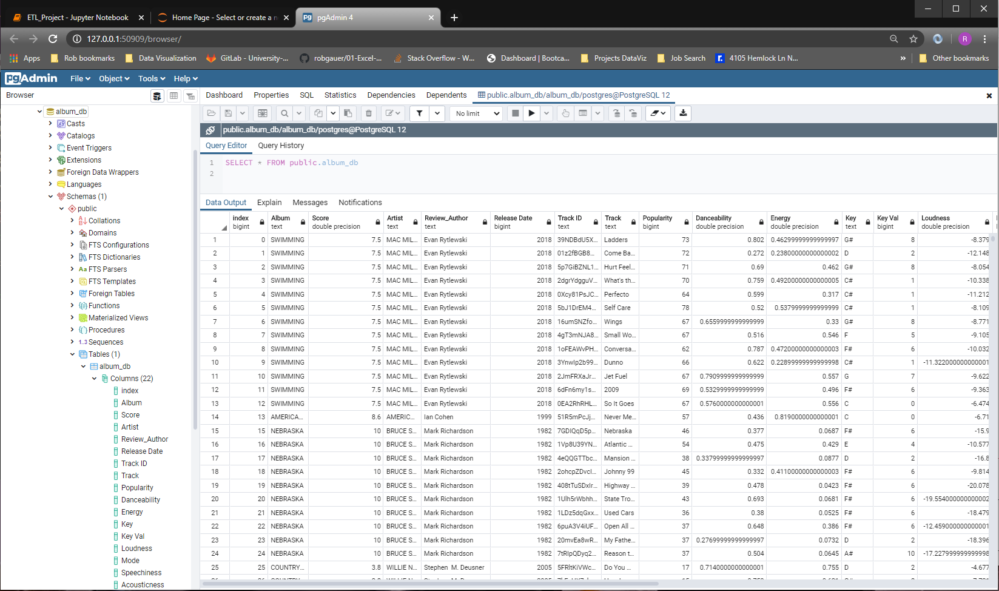

# ETL PROJECT
This document contains guidelines, requirements, and suggestions for the ETL Project.
* Date Due: Tuesday June 9, 2020

# ETL Project Guidelines 
### Team Effort
Due to the short timeline, teamwork will be crucial to the success of this project! Work closely with your team through all phases of the project to ensure that there are no surprises at the end of the week. Working in a group enables you to tackle more difficult problems than you'd be able to working alone. In other words, working in a group allows you to **work smart** and **dream big**. Take advantage of it!

# Project Team
### Team 6 - ETL Project Members
    * Nisha Saphota
    * Daniel Eddie
    * Jon Simpson
    * Rob Gauer

# Team Plan Goals
### ETL Project Overview of Team Targets/Goals to Completion
    * Objective:  Define a 3rd party review score of albums based on datasets B.2 and B.3 below. (Team correct me if I am in error...?)
    1) Saturday May 30. Research topics, determine topic. Submit Topic Form. A.1 below.
    2) Tuesday June 2. Goal for Tuesday eveing class was to finalize the data sources and begin data modeling and data engineering action items. 
    3) Thursday June 4. Complete data engineering and load database MongoDB. C.1 and C.2 below.
    4) Saturday June 6. Final review of MongoDB. Create team report for submittion by end of class. D.1 below.

# Project Proposal and Submission
### A. Project Proposal 
Before you start writing any code, remember that you only have one week to complete this project. View this project as a typical assignment from work. Imagine a bunch of data came in and you and your team are tasked with migrating it to a production data base. Take advantage of your Instructor and TA support during office hours and class project work time. They are a valuable resource and can help you stay on track.

    Extract, Transform, Load Report Proposal Form
    A.1 https://files.slack.com/files-pri/TTBSW3KEH-F0158RNJ7QQ/image.png

# Data Sources
### B. Finding Data 
Your project must use 2 or more sources of data. We recommend the following sites to use as sources of data:
(You can also use APIs or data scraped from the web. However, get approval from your instructor first. Again, there is only a week to complete this!)

    B.1) Spotify Dataset 1921-2020, 160k+ Tracks. Decided as of Tuesday evening to not go forward with this dataset. 
    * [Kaggle](https://www.kaggle.com/yamaerenay/spotify-dataset-19212020-160k-tracks/)
    * Audio features of 160k+ songs released in between 1921 and 2020.

    B.2) P4KxSpotify: A Dataset of Pitchfork Music Reviews and Spotify Musical Features.
    * [Zenodo](https://https://zenodo.org/record/3603330#.XtbnKzpKiHs/)
    * 8,403 music reviews scraped from Pitchfork, including relevant metadata such as author, review date, record release year, score, and genre, along with those album's audio features pulled from Spotify's API.

    B.3) Spotify API Features Data: 60,000+ Songs.
    * [Kaggle](https://www.kaggle.com/memv23/spotify-api-features-data-60000-songs)
    * Spotify API Features Data: 60,000+ Songs.

# Data Modeling and Engineering
### C. Data Cleanup & Analysis - Goal for Thursday evening class is to clean and load the data into MongoDB. 
Once you have identified your datasets, perform ETL on the data. Make sure to plan and document the following:

    C.1) Data Modeling and Engineering.
    a. ERD - [http://www.quickdatabasediagrams.com]
    b. The type of transformation needed for this data (cleaning, joining, filtering, aggregating, etc).
    c. Clean data so anything older than 1960 is eliminated.

    C.2) The type of final production database to load the data into (relational or non-relational).
    a. Choose your DB - SQL or MongoDB?  Decided to use MongoDB.
    b. The final tables or collections that will be used in the production database.
    c. Load the data into MongoDB.

# Project Technical Report 
### D. Project Reference Information
    ETL Project Team GitHub:  https://github.com/robgauer/Team_ETL_Project/tree/master
    Project Code file name:  https://github.com/robgauer/Team_ETL_Project/blob/master/ETL_Project.ipynb
    PostgreSQL Database:  album_db

figure: PostgreSQL_album_db.png

### ETL Project Technical Report:
### At the end of the week, your team will submit a Final Report that describes the following:
    
* **E**xtract: your original data sources and how the data was formatted (CSV, JSON, pgAdmin 4, etc).
    For our project, we chose our data sets from two sources: for the list of music from Spotify, we chose two datasets.
    The first set of data came from Kaggle and was a .csv file. The data was for 61,045 songs pulled from different 
    Spotify playlists. It contains fourteen numerical ratings for categories such as popularity, danceability, tempo,
    energy, and loudness. Each song’s Spotify ID is also included, as well as the album the song was released on.
    The second dataset was downloaded from Zenodo was a .csv file of Billboard magazine rankings for Album’s found 
    on Spotify. As with the Kaggle dataset, the fourteen numerical categories were included. In addition, data about
    the review wasalso included, such as the reviewer’s name and score given to the album. Some album’s had multiple
    reviews; the review date was also included.We researched the possibility of using Spotify’s API to pull our own 
    data for use in our project, however we discovered a downside to this approach. Spotify’s API requires the use 
    of an id to perform queries on song tracks or albums. So, for example, if you wanted to pull up the information 
    for a specific album, you would have to provide either the album title or the album’s id. You cannot just run 
    a blind query and find all the songs in a specific musical category on Spotify. Spotify has created their API 
    more for those users who are looking to build apps thatuse Spotify, or web-based integration, versus someone 
    querying large amounts of data. To effectively build a large set of data on our own, we would have to find 
    the idfor many user-generated playlists and query that data. We decided against this approach; for the scope 
    of our project, it would take too long to find the playlists we wanted to give us a wide range of music, and 
    with the dataset from Kaggle already providing that information, it would not have added any additional useful data.

* **T**ransform: what data cleaning or transformation was required.
    
    
* **L**oad: the final database, tables/collections, and why this was chosen.
    After the transformation of data, the last step was to load our final output into a database. 
    The database was created and the clean data from the final panda’s data frame was loaded to SQL using SQL Alchemy. 
    Here, we verified the data using select query. 
    See figure: PostgreSQL_album_db.png above.

    Moreover, the whole data was read from the table and loaded to the new data frame. The data frame was sorted 
    by score and album. Finally, the transformed data frame was saved to csv file. SummaryWe extracted these 
    data sets from different sources. Those data are loaded into data frame andmerged based on shared fields 
    (album and artists). The dataset was cleaned by removing duplicates and unnecessary data. And the final 
    data frame was loaded into database.

# Project Submission Requirements
### F. Please upload the report to Github and submit a link to Bootcampspot.
# D.1) Technical Report.
# a. You will be required to submit a final technical report with the above information and steps required to reproduce your ETL process. 
* See ETL Project Technical Report above.

- - -
#### Copyright
#### Coding Boot Camp © 2019. All Rights Reserved.